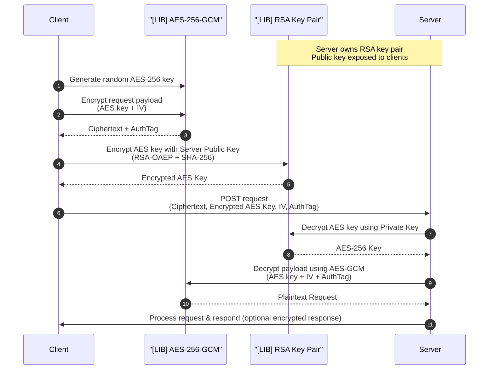

# E2E Encrypted Bridge for TypeScript

Part 1: "Secure Bridge" (TypeScript Library)
> Requirement: Create a standalone TypeScript library (e.g., a class or module) that abstracts away the complexity of cryptography.

- Core Logic (Hybrid Encryption):
- The library must accept a Public Key (RSA/ECC) upon initialization.
- For every submission:

  1. Generate a transient Symmetric Key (e.g., AES-256).
  2. Encrypt the payload (National ID) with this Symmetric Key.
  3. Encrypt the Symmetric Key itself using the Server's Public Key.
  4. Return the packaged payload: { encrypted_data: "...", encrypted_key: "..." }.

- Deliverable: A TypeScript file/module demonstrating this logic.

## Sequence diagram

