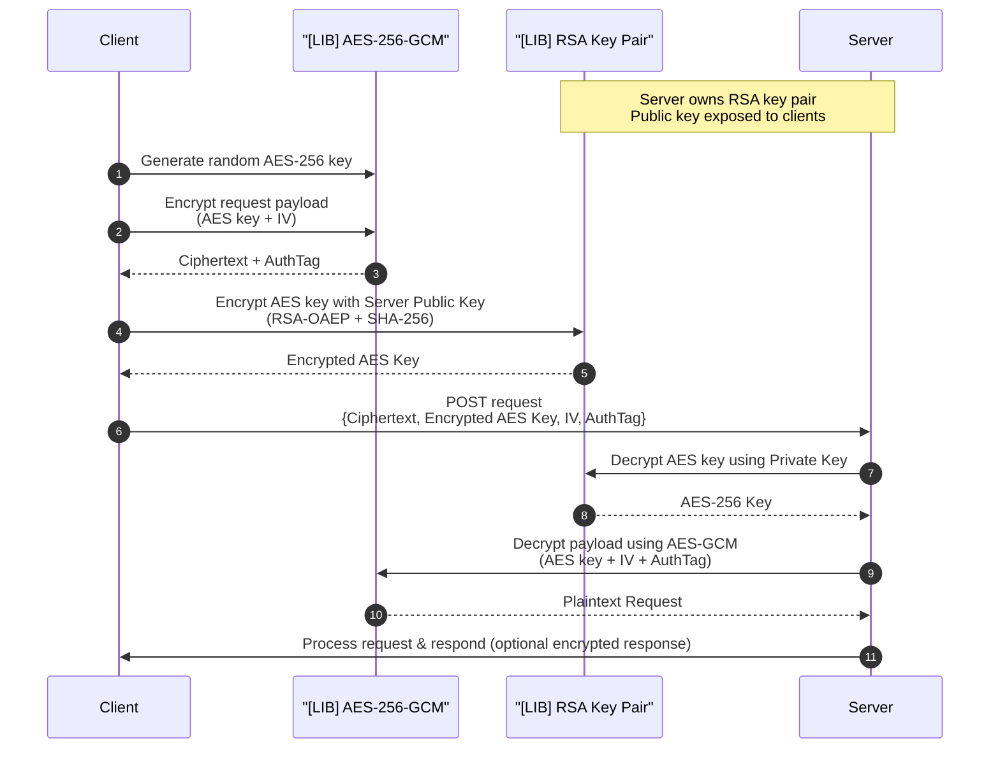

# Secure Bridge Library

A TypeScript library implementing hybrid encryption using AES-256-GCM and RSA-OAEP for secure client-server communication.

## Overview

Part 1: "Secure Bridge" (TypeScript Library)
> Requirement: Create a standalone TypeScript library (e.g., a class or module) that abstracts away the complexity of cryptography.

- Core Logic (Hybrid Encryption):
- The library must accept a Public Key (RSA/ECC) upon initialization.
- For every submission:

  1. Generate a transient Symmetric Key (e.g., AES-256).
  2. Encrypt the payload (National ID) with this Symmetric Key.
  3. Encrypt the Symmetric Key itself using the Server's Public Key.
  4. Return the packaged payload: { encrypted_data: "...", encrypted_key: "..." }.

- Deliverable: A TypeScript file/module demonstrating this logic.

## Features

- **AES-256-GCM Encryption**: Symmetric encryption with authenticated encryption
- **RSA-OAEP Key Encryption**: Asymmetric encryption with SHA-256 hashing
- **Hybrid Encryption**: Combines speed of AES with security of RSA
- **Type-Safe**: Full TypeScript support with comprehensive type definitions

## Installation

```bash
bun install
```

## Usage

### Quick Start - Full Workflow

```typescript
import { SecureBridge, RSAKeyPairManager } from 'secure-bridge-lib';

// Server: Generate RSA key pair
const serverKeys = RSAKeyPairManager.generateKeyPair();
console.log('Server Public Key:', serverKeys.publicKey);

// Client: Encrypt request
const payload = JSON.stringify({ message: 'Hello Server!', data: { userId: 123 } });
const encryptedRequest = SecureBridge.encryptRequest(payload, serverKeys.publicKey);

console.log('Encrypted Payload:', encryptedRequest);
// Send encryptedRequest to server...

// Server: Decrypt request
const decryptedPayload = SecureBridge.decryptRequest(encryptedRequest, serverKeys.privateKey);
console.log('Decrypted:', decryptedPayload);
// Outputs: {"message":"Hello Server!","data":{"userId":123}}
```

### Low-Level API

#### AES-256-GCM Operations

```typescript
import { AES256GCM } from 'secure-bridge-lib';

// Encrypt with auto-generated key
const encrypted = AES256GCM.encrypt('sensitive data');
console.log(encrypted);
// {
//   ciphertext: '...',
//   iv: '...',
//   authTag: '...',
//   key: '...'
// }

// Decrypt
const plaintext = AES256GCM.decrypt({
  ciphertext: encrypted.ciphertext,
  iv: encrypted.iv,
  authTag: encrypted.authTag,
  key: encrypted.key,
});
console.log(plaintext); // 'sensitive data'

// Use your own key
const myKey = AES256GCM.generateKey();
const encrypted2 = AES256GCM.encrypt('data', myKey);
```

#### RSA Key Pair Operations

```typescript
import { RSAKeyPairManager } from 'secure-bridge-lib';

// Generate key pair
const keyPair = RSAKeyPairManager.generateKeyPair();

// Encrypt (typically for AES keys)
const aesKey = AES256GCM.generateKey();
const encryptedKey = RSAKeyPairManager.encryptWithPublicKey(aesKey, keyPair.publicKey);

// Decrypt
const decryptedKey = RSAKeyPairManager.decryptWithPrivateKey(encryptedKey, keyPair.privateKey);
console.log(aesKey === decryptedKey); // true
```

## API Reference

### `SecureBridge`

High-level API for hybrid encryption.

#### `SecureBridge.encryptRequest(payload, serverPublicKey)`

Encrypts a payload using AES-256-GCM and encrypts the AES key with RSA.

**Parameters:**
- `payload` (string): Data to encrypt
- `serverPublicKey` (string): Server's RSA public key in PEM format

**Returns:** `EncryptedPayload`
```typescript
{
  ciphertext: string;      // Base64 encoded encrypted payload
  encryptedAESKey: string; // Base64 encoded RSA-encrypted AES key
  iv: string;              // Base64 encoded initialization vector
  authTag: string;         // Base64 encoded authentication tag
}
```

#### `SecureBridge.decryptRequest(encryptedPayload, serverPrivateKey)`

Decrypts a payload encrypted by `encryptRequest`.

**Parameters:**
- `encryptedPayload` (EncryptedPayload): Encrypted data from client
- `serverPrivateKey` (string): Server's RSA private key in PEM format

**Returns:** `string` - Decrypted plaintext

---

### `AES256GCM`

Low-level AES-256-GCM encryption operations.

#### `AES256GCM.generateKey()`

Generates a random 256-bit AES key.

**Returns:** `string` - Base64 encoded key

#### `AES256GCM.generateIV()`

Generates a random 96-bit initialization vector.

**Returns:** `string` - Base64 encoded IV

#### `AES256GCM.encrypt(plaintext, key?)`

Encrypts data using AES-256-GCM.

**Parameters:**
- `plaintext` (string): Data to encrypt
- `key` (string, optional): Base64 encoded AES key (auto-generated if not provided)

**Returns:** `AESEncryptionResult`

#### `AES256GCM.decrypt(input)`

Decrypts data using AES-256-GCM.

**Parameters:**
- `input` (AESDecryptionInput): Decryption parameters

**Returns:** `string` - Decrypted plaintext

**Throws:** Error if authentication fails

---

### `RSAKeyPairManager`

RSA key pair generation and encryption operations.

#### `RSAKeyPairManager.generateKeyPair()`

Generates a 2048-bit RSA key pair.

**Returns:** `RSAKeyPair`
```typescript
{
  publicKey: string;  // PEM format
  privateKey: string; // PEM format
}
```

#### `RSAKeyPairManager.encryptWithPublicKey(data, publicKeyPEM)`

Encrypts data using RSA-OAEP with SHA-256.

**Parameters:**
- `data` (string): Base64 encoded data to encrypt
- `publicKeyPEM` (string): Public key in PEM format

**Returns:** `string` - Base64 encoded encrypted data

#### `RSAKeyPairManager.decryptWithPrivateKey(encryptedData, privateKeyPEM)`

Decrypts data using RSA-OAEP with SHA-256.

**Parameters:**
- `encryptedData` (string): Base64 encoded encrypted data
- `privateKeyPEM` (string): Private key in PEM format

**Returns:** `string` - Base64 encoded decrypted data

## Security Features

- **AES-256-GCM**:
  - 256-bit key length
  - 96-bit IV (recommended for GCM mode)
  - 128-bit authentication tag
  - Authenticated encryption (prevents tampering)

- **RSA-OAEP**:
  - 2048-bit key size
  - SHA-256 hash function
  - OAEP padding for semantic security

- **Hybrid Approach**:
  - Fast symmetric encryption for payload
  - Secure asymmetric encryption for key exchange
  - Each request uses a fresh AES key

## Workflow

```
Client                                    Server
------                                    ------
1. Generate random AES-256 key
2. Encrypt payload with AES-GCM
   → ciphertext, IV, authTag
3. Encrypt AES key with Server's
   RSA public key
   → encryptedAESKey
4. Send all to server             →
                                          5. Decrypt AES key with
                                             RSA private key
                                          6. Decrypt payload with
                                             AES-GCM
                                          7. Verify authentication tag
                                          8. Process request
```

## Sequence diagram



## Example: HTTP Request

```typescript
import { SecureBridge, RSAKeyPairManager } from 'secure-bridge-lib';

// Server setup (do this once)
const serverKeys = RSAKeyPairManager.generateKeyPair();
// Store serverKeys.privateKey securely on server
// Publish serverKeys.publicKey to clients

// Client: Prepare request
const requestData = {
  action: 'createUser',
  user: { name: 'Alice', email: 'alice@example.com' }
};
const encrypted = SecureBridge.encryptRequest(
  JSON.stringify(requestData),
  serverKeys.publicKey
);

// Client: Send to server
fetch('/api/secure', {
  method: 'POST',
  headers: { 'Content-Type': 'application/json' },
  body: JSON.stringify(encrypted)
});

// Server: Receive and decrypt
const decrypted = SecureBridge.decryptRequest(encrypted, serverKeys.privateKey);
const requestData = JSON.parse(decrypted);
console.log(requestData.action); // 'createUser'
```

## License

MIT
